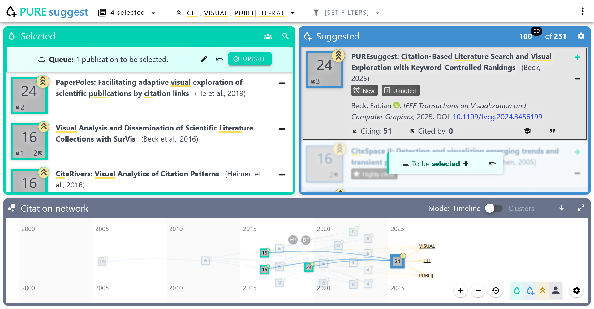

# PURE suggest

*PURE suggest* is a scientific literature search tool that, starting from some seed papers, suggests scientific publications through citations/references.

The tool is available at: https://fabian-beck.github.io/pure-suggest/



## Key features

* Select multiple publications and get suggestions based on citations of these
* Rank the suggestions by a citation score
* Boost the score with specific keywords of interest
* Visualization of citations in a network diagram on a timeline and as clusters

## What is more

* Add publications to selection by DOI, title, or search
* Marking unread suggestions
* Highlighting of an active publication across the views
* Automatic tagging of special publication characteristics (e.g., highly cited)
* Quick access to publications through links (DOIs, open access versions, or Google Scholar)
* Keyboard controls for an efficient workflow
* Export/import search session
* Export selected publications to BibTeX
* Responsive design that allows working on your phone

## Scientific publication

If you want to cite the tool, you can refer to the following publication:

* Beck, F. and Krause, C., 2022. Visually Explaining Publication Ranks in Citation-based Literature Search with PURE suggest. In EuroVis 2022 - Posters. DOI: [10.2312/evp.20221110](https://diglib.eg.org/handle/10.2312/evp20221110). [[PDF](https://diglib.eg.org/bitstream/handle/10.2312/evp20221110/019-021.pdf)]

## Project setup
```
npm install
```

### Compiles and hot-reloads for development
```
npm run serve
```

### Compiles and minifies for production
```
npm run build
```
